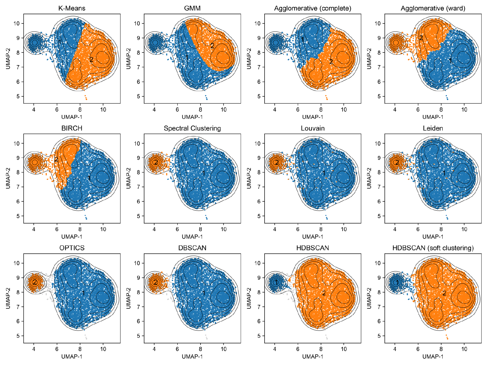

Unsupervised Clustering algorithms
==================================

Benchmarking
------------

We tested many types of clustering algorithms. Among these methods, ``Spectral clustering``, ``Louvain``, and ``Leiden`` are the graph-based ones perform well with fly embryo m5C data; while density-based methods, like ``OPTICS``, ``DBSCAN``, and ``HDBSCAN`` work perfectly.

We finally pick up HDBSCAN for many reasons:

1. ``Spectral clustering`` and ``OPTICS`` require a lot of memory and run slow in test.
2. ``Louvain`` and ``Leiden``, although perform well in this test, we found that we are hard to tune them with a single parameter (``resolution_parameter``). These two algorithms will generate a lot of interlaced small clusters if the parameters is not proper.

.. image:: ../Images/Clustering_scatter.leiden.parameters.png
   :align: center

(we only show the results from ``Leiden``, because ``Leiden`` and ``Louvain`` perform similarly)

3. ``HDBSCAN`` is an evolved version of ``DBSCAN``, to make it possible to isolate the adjacent high density clusters. So we will not use ``DBSCAN``.
4. ``HDBSCAN`` has a set of useful parameters to adjust. We can clear get the structure of clusters for the ``condensed tree`` from ``HDBSCAN``.
5. ``HDBSCAN`` can perfrom both standard clustering (with some dat points not assigned) and "soft clustering" (complete classification), which is very important for us in the analysis.
6. Our requirement is the algorithm recognizing the density, right?

Parameters of HDBSCAN 
---------------------

The official documenet of ``HDBSCAN`` is super clear for its mechanism (https://hdbscan.readthedocs.io/en/latest/how_hdbscan_works.html) and parameter selection (https://hdbscan.readthedocs.io/en/latest/parameter_selection.html)

In breif, there are several useful parameters in ``HDBSCAN``:

1. ``cluster_selection_method``. By default we use ``eom`` (Excess of Mass). For manually clustering in a higher resolution, we might also use ``leaf`` option (see :doc:`advanced_users`).
2. ``min_cluster_size``. This parameter determines the minimal number of sites required for a cluster. Higher value means bigger clusters (sometimes more connected big clusters), while smaller value means more sparse clusters.
3. ``min_samples``. This parameter determines the scale of sampling. We can adjust ``min_cluster_size`` and ``min_samples`` simutaneously to get suitable results.
4. ``cluster_selection_epsilon`` is also a very important parameter. With this parameter, you can adjust the minimal epsilon (diameter) requirement with it. See https://hdbscan.readthedocs.io/en/latest/how_to_use_epsilon.html. If your clusters vary a lot in size, be careful to use this parameter.
5. ``alpha`` has little effects on clustering. 

Soft clustering
---------------
The documenet for ``soft clustering`` is here (https://hdbscan.readthedocs.io/en/latest/soft_clustering.html).

In breif, with ``soft clustering``, you will have a much higher ``Recall`` (how many sites you retrive), but it also will result in a decreased ``Precision``. Our recommandation is:

* If your data is clean enough or the clusters are well separated, just be brave to apply ``soft clustering``.

* If you want a complete clustering, you have no choice.

* But if you just want some of the sites or you don't care about the intermediates between cluster centroids, just perform the standard one.

.. tip:: Soft clustering is not available in GPU acceleration now.

.. tip:: You can also use the pre-built HDBSCAN model to predict new sites.

Check the tree 
--------------

The most attractive thing in ``HDBSCAN`` is that you can estimate how perfeCt your clustering is by drawing the ``condensed tree``. (https://hdbscan.readthedocs.io/en/latest/how_hdbscan_works.html)

.. image:: ../Images/HDBSCAN_condensed_tree.png
   :align: center

This is a plot for the condensed tree in our Noc-treated HeLa cells. In this example, we can clear find that ``eom`` function split the density tree into three major clusters (red, blue and green). It is undisputed that the red (NSUN5) and blue (NSUN6) clusters are clearly separated (OK, I know NSUN5 has two motif sub-types), however, the green one (normally believed to be methylate by NSUN2), contains multiple clusters (indicated by red arrows). In practices, we can isolate the sequences from leaves split in each branches to find out what exactly inside. If the overall number of leaves is not high (or in order), you can also extract them at once, and mannual merge them by yourself (see :doc:`advanced_users`).