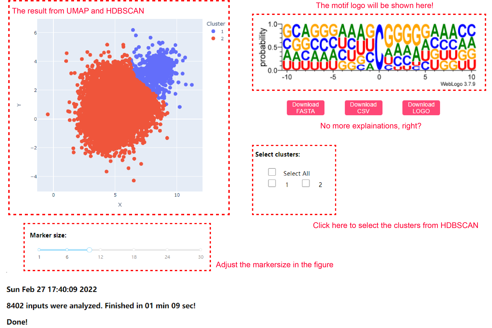

For beginners
=============

The interactive interface
-------------------------

We designed an interactive interface (a viewer) for you if you are not famaliar with programming. Here is a tutorial.

Before using the viewer, please install ``iMVP-utils`` first (see :doc:`install`), then run the script ``iMVP_viewer.py`` by typing it in your shell:

.. code-block:: sh

    iMVP_viewer.py

this operation will open a backend of the iMVP viewer, and you can visit the application via your browser. By default, please type ``127.0.0.1:8050`` in your URL box to access it.

If you want to run the backend on your sever but work with it in another computer, you can assign a IP address for it:

.. code-block:: sh

    iMVP_viewer.py --host xxx:xxx:xxx:xxx

here, ``xxx:xxx:xxx:xxx`` should be the IP address of the sever, for example ``123.123.123.123``. Then you can visit from the browser of another computer with ``xxx:xxx:xxx:xxx:8050``. Use ``--port`` option if you want to switch to another port.

You will visit this page when you succeed in launching the application. You can drag your FASTA file to the upload box, or just click it to send your file to the sever. Then you should adjust the parameters on the right. When everything is ready, click "submit" to run ``iMVP``

.. image:: ../Images/Guide/Guide_1.png
    :align: center

|

When ``UMAP`` and ``HDBSCAN`` finished, you will find a "Draw the figure" button, click it to get the figure.

.. image:: ../Images/Guide/Guide_2.png
    :align: center

|

And you will find your UMAP projections with the clusters labled in different colors. You can click the check box to select one or several groups classified by ``HDBSCAN``. You can download the FASTA file and the PNG logo file by clicking the corresponding button.

|

Of course, you can also use a selector/lasso to plot a set of sites manually.

.. image:: ../Images/Guide/Guide_4.png
    :align: center

.. tip:: Double click the figure to release the selector.

If you want to modify your parameters, please ``refresh`` the page.

Use ``Ctrl`` + ``C`` to terminate the backend.

Simple notebook examples
------------------------

To make it clear, we use ``Jupyter-notebook`` (https://jupyter.org/) to present the backend of ``iMVP``. With this `tutorial <https://hub.gke2.mybinder.org/user/ipython-ipython-in-depth-49oqm5zn/notebooks/binder/Index.ipynb>`_, you can easily set up your ``Jupyter-notebook`` server in your computer. When you set up ``Jupyter-notebook``, you can simply repeat our scripts.

You can work with the well packaged functions in ``beginners.ipynb``.

After clustering
----------------

We suggest you to plot the clusters with ``Weblogo`` (https://weblogo.berkeley.edu/) directly. You can also analyze the sequences from the clusters with ``MEME`` (https://meme-suite.org/meme/doc/meme.html), ``HOMER`` (http://homer.ucsd.edu/homer/), and other motif finders.
